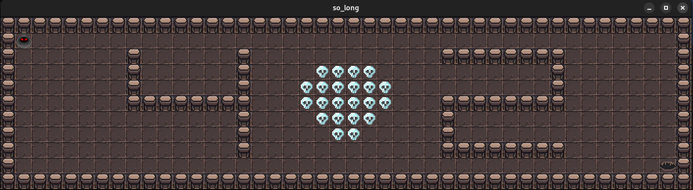

# So Long

**So Long** is a simple 2D game where the player must collect all collectibles and find an exit to complete the level. The game is developed in C using MLX42, and adaptation of the MiniLibX graphical library, with a focus on handling textures, sprites, and basic gameplay mechanics.

<br>



<br>

## How to Run

1. Clone this repository:
   ```bash
   git clone https://github.com/dracudev/So-Long
   ```
2. Navigate into the cloned directory and run make. This will compile all the source files and create the game.

   ```bash
   cd So-Long
   make
   ```
   
3. Run the game with a .ber map file:
   ```bash
   ./so_long /map/map1.ber
   ```   
4. You can use the provided maps or create your own custom maps following the [map guidelines](#map-requirements).

5. Additional Makefile Commands:

  - `make clean`: Removes all the object files (*.o) created during the compilation process. This is useful for cleaning up the directory without removing the compiled libraries and the game.
    
  - `make fclean`: Performs a deeper clean by removing all the object files as well as the compiled libraries and the game. This essentially resets the directory to its initial state before compilation.

  - `make re`: Combines the fclean and make commands to first remove all compiled files and then recompile the entire game. This is useful if you want to ensure a completely fresh build.

<br>

## Project Summary

This project is designed to enhance your skills in C programming and graphical management using MLX42. You will work with event handling, window management, and the display of 2D textures to create a small game. The game involves navigating a character through a maze, collecting items, and reaching an exit.

<br>

## Features

- **2D Game**: The game is rendered from a top-down perspective.
- **Movement**: The player can move in four directions (W, A, S, D).
- **Collectibles**: The player must collect all items on the map before reaching the exit.
- **Map Validation**: The map follows specific rules for structure and components, such as walls, spaces, collectibles, and an exit.
- **Movement Counter**: Every move is counted and displayed in the terminal.
- **Error Handling**: The program handles errors like invalid map structure or duplicate characters.

<br>

## Gameplay

The goal of the game is to collect every collectible on the map and reach the exit with the least amount of moves possible. The player cannot move through walls and must follow the correct path to complete the level.

### Controls:
- `W`, `A`, `S`, `D`: Move the character.
- `ESC`: Exit the game.

<br>

## Map Requirements

The map file passed as an argument to the game must adhere to the following rules:
- **Components**: 
  - `1`: Wall
  - `0`: Empty space
  - `C`: Collectible
  - `E`: Exit
  - `P`: Player start position
- **Structure**: 
  - The map must be rectangular.
  - It must be surrounded by walls (`1`).
  - It should have one exit (`E`), one player start position (`P`) and at least one collectible (`C`).
  - There must be a valid path from the player (`P`) to all collectibles (`C`) and the exit (`E`).

<br>

## Credits

- This project uses the [MLX42](https://github.com/codam-coding-college/MLX42), an adaptation of [MiniLibX](https://github.com/42Paris/minilibx-linux) library for window and image management.
- The sprites are sourced from Itch.io:
   - [Dungeon Tileset II](https://0x72.itch.io/dungeontileset-ii)
   - [RPG Icon Pack: Jewels and Gems](https://clockworkraven.itch.io/rpg-icon-pack-jewels-and-gems)
